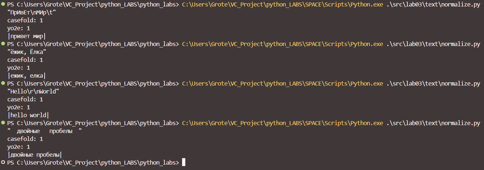
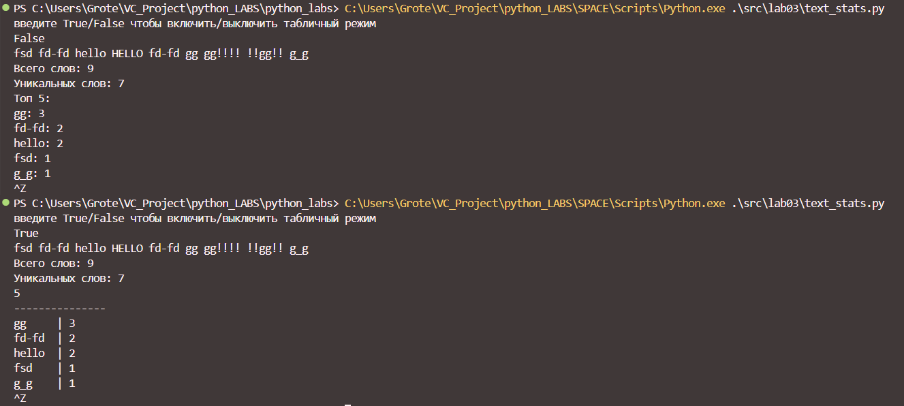
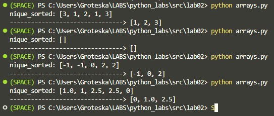
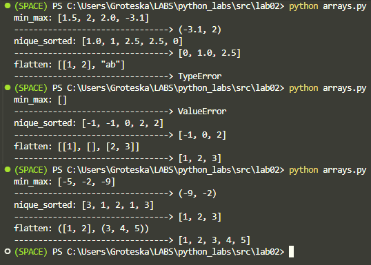
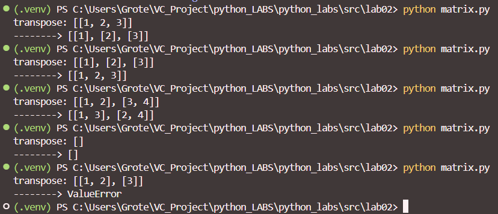
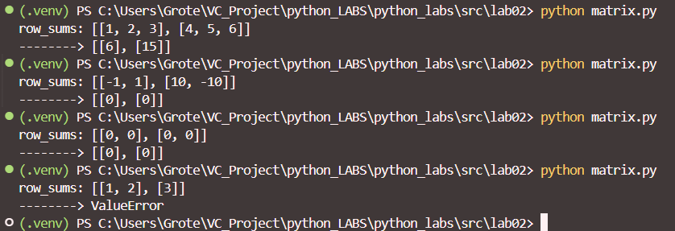
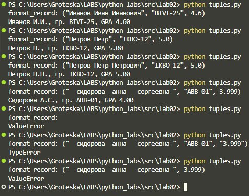

## Лабораторная работа номер 4
в файле input.txt: Hello World
### Задание A (io_text_csv)

```Python
from pathlib import Path
import sys
import csv
from collections import Counter
import os

PROJECT_ROOT = Path(__file__).parent.parent.parent
sys.path.insert(0, str(PROJECT_ROOT))

from src.lab03.text.tokenize import tokenize_f
from src.lab03.text.normalize import normalize_f


def ensure_parent_dir(path: str | Path) -> None:
    path.parent.mkdir(parents=True, exist_ok=True) #создаю родительские директории (Parents=True)/ НЕ вызываю ошибку при их отсуцтвии (exist_ok=True)


def read_text(path: str | Path, encoding: str = "utf-8") -> str:
    path=Path(path)
    if not path.exists():
        raise FileNotFoundError("Файл не найден")
    try:
        with open(path,"r",newline="",encoding=encoding) as file:
            in_file=str(file.read())
        return normalize_f(in_file)
    except UnicodeDecodeError:
        print("неверная кодировка")


# print({Path.cwd()})
# for item in Path.cwd().iterdir():
#     print(f"  {item.name}")
# print(read_text(Path("data") / "input.txt"))

# def ensure_parent_dir(path: str | Path) -> None:
#     if 

def write_csv(rows: list[tuple | list], path: str | Path, header: tuple[str, ...] | None = None) -> None:
    path=Path(path)
    ensure_parent_dir(path)
    len_form=len(rows[0])
    for x in rows:
        if len_form!=len(x):
            raise ValueError("Ошибка чтения файла")
            break
    with open(path,"w",newline="",encoding="utf-8") as file:
        if header is not None:
            csv.writer(file,delimiter=",").writerow(header)
        csv.writer(file,delimiter=",").writerows(rows)
        print("файл создан/изменен")


def frequencies_from_text(text: str) -> dict[str, int]:
    if text==None:
        raise ValueError("неверный формат")
    tokens = tokenize_f(normalize_f(text))
    return Counter(tokens)  # dict-like

def sorted_word_counts(freq: dict[str, int]) -> list[tuple[str, int]]:
    return sorted(freq.items(), key=lambda kv: (-kv[1], kv[0]))
```


### Задание B (text_report)
```Python
from io_text_csv import read_text, write_csv, frequencies_from_text,sorted_word_counts
import csv
from pathlib import Path
import sys

# PROJECT_ROOT = Path(__file__).parent.parent.parent
# sys.path.insert(0, str(PROJECT_ROOT))

# from src.lab03.text.normalize import normalize_f
from src.lab03.text.tokenize import tokenize_f
from src.lab03.text.count_freq import count_freq_f, top_n
from src.lab03.text_stats import text_stats_f

enc=input("введите кодировку: ")
line=Path(input("введите путь к файлу: "))
work_str=read_text(line,encoding=enc)
print(count_freq_f(tokenize_f(work_str)))
print(text_stats_f(work_str,False))
write_csv(top_n(count_freq_f(tokenize_f(work_str))),"data/lab04/report.csv",("word","count"))
```
[image 11](./images/lab04/B/B1.png)
[image 111](./images/lab04/B/B2.png)

### Задание D*
```Python
from io_text_csv import read_text, write_csv, frequencies_from_text,sorted_word_counts
import csv
from pathlib import Path
import sys

# PROJECT_ROOT = Path(__file__).parent.parent.parent
# sys.path.insert(0, str(PROJECT_ROOT))

# from src.lab03.text.normalize import normalize_f
from src.lab03.text.tokenize import tokenize_f
from src.lab03.text.count_freq import count_freq_f, top_n
from src.lab03.text_stats import text_stats_f

enc=input("введите кодировку: ")
try:
    k=int(input("введите количество файлов: "))
except ValueError:
    print("Неправильно указано количество файлов") 
    exit()
# if type(k)!="int":
#     raise TypeError("Неправильно указано количество файлов")
mas=[]
f_names=[]
for i in range(k):
    # mas=mas.append(read_text(Path(input((f"введите путь к  файлу {i}: ")))))
    A=input(f"введите путь к  файлу {i+1}: ")
    f_names.append(A.split("/")[-1])
    print(f_names)
    mas.append(read_text(Path(A),enc))
# print(mas)
per={}
total={}
for i in range(k):
    work_str=mas[i]
    if work_str==None:
        break
    print(work_str)
    # print(count_freq_f(tokenize_f(work_str)))
    # print(text_stats_f(work_str,False))
    print(count_freq_f(tokenize_f(work_str)))
    per.update(count_freq_f(tokenize_f(work_str)))
    total.update({f"{f_names[i]},{key}": value for key, value in per.items()})
    print(total)
print(per)
write_csv(top_n(count_freq_f(tokenize_f(work_str))),"data/lab04/report_per_file.csv",("word","count"))
write_csv((sorted(total.items(),reverse=True, key=lambda item: item[1])),"data/lab04/report_total.csv",("file","word","count"))
```
[image 333](./images/lab04/D/D1.png)
[image 323](./images/lab04/D/D2.png)
[image 433](./images/lab04/D/D3.png)


## Лабораторная работа номер 3
### Задане A (text)
#### normalize
```Python
from ast import literal_eval
import sys
def normalize(text: str, casefold: bool = True, yo2e: bool = True) -> str:
    lvl_1=""
    answ=""
    # print("----->",text)
    if yo2e:
        text=text.replace("ё","е").replace("Ё","Е")
    text=text.replace("\\t"," ").replace("\\r"," ").replace("\\n"," ")
    # print(text.split())
    lvl_1=" ".join(text.split())
    # lvl_1=[x.join(" ")for x in lvl_1.split()]
    # print("--------->",lvl_1)
    if casefold:
        for x in lvl_1:
            answ+=x.lower()
        return answ
    else:
        return lvl_1
```

#### tokenize
``` Python
from .normalize import normalize
import re
from ast import literal_eval
def tokenize(text: str) -> list[str]:
    text=normalize(text)
    # print(text)
    mas=re.findall(r'\w+\-\w+|\w+',text)
    answ=[x for x in mas if x!="" and x!=None]
    # print(mas)
    return answ
```

#### count_freq
```Python
def count_freq(tokens: list[str]) -> dict[str, int]:
    answ={}
    a=set(tokens)
    # print(a)
    for i in a:
        answ[i] = tokens.count(i)
    # print(answ["a"])
    return answ

def top_n(freq: dict[str, int], n: int = 5) -> list[tuple[str, int]]:
    answ=[]
    lvl_1={}
    keys=sorted(freq)
    for i in keys:
        lvl_1[i]=freq[i]
    # print("--->",lvl_1)
    # print(keys)
    answ=sorted(lvl_1.items(),reverse=True, key=lambda item: item[1])
    return answ
```

### Задание B (text_stats)
```Python
import sys
from text.count_freq import top_n
from text.count_freq import count_freq
from text.normalize import normalize
from text.tokenize import tokenize


def text_stats(inp: str, flag: str) -> str:
    print(f'Всего слов: {len(inp.split())}')
    print(f'Уникальных слов: {len(set(inp.split()))}')
    mas=tokenize(normalize(inp))
    # inp=normalize(inp,1,1)
    # print(inp)
    if flag=="True":
        par_1=max([len(x) for x in mas])
        print(par_1)
        if par_1>5:
            print("слово"," "*abs(par_1-5),"|","частота")
        elif par_1<5:
            print("слово"," |","частота")
            par_1=5
        print("-"*(par_1+abs(par_1-5)+10))
        n=5
        x=0
        if len(top_n(count_freq(mas)))<5:
            n=len(top_n(count_freq(mas)))
        for i in top_n(count_freq(mas)):
            if x==n:
                break
            print(f'{i[0]} {" "*(par_1-len(i[0]))} | {i[1]}')
            x+=1
    else:
        print("Топ 5:")
        x=0
        n=5
        if len(top_n(count_freq(mas)))<5:
            n=len(top_n(count_freq(mas)))
        while x<n:
            i=top_n(count_freq(mas))[x]
            print(f'{i[0]}: {i[1]}')
            x+=1

print("введите True/False чтобы включить/выключить табличный режим")
key=input()
for line in sys.stdin:
    text_stats(normalize(line,1,1),key)
```



## Лабораторная работа номер 2
### Задание 1 (arrays)
#### min_max.py
```Python
from typing import Union
import json

def min_max(input_data: list[int|float]) -> list[int|float]:
    if input_data==[]:
        return "ValueError"
    else:
        return min(input_data),max(input_data)

print(min_max(json.loads(input("min_max: "))))
# print(min_max([int(float(x)) if float(x)%1==0  else float(x) for x in input().split()]))
```


#### unique_sorted.py
```Python
from typing import Union
import json

def unique_sorted(nums: list[float | int]) -> list[float | int]:
    return sorted(set(nums))

print(unique_sorted(json.loads(input("nique_sorted: "))))
# print(unique_sorted([int(float(x)) if float(x)%1==0  else float(x) for x in input().split()]))
```

#### flatten.py
```Python
from typing import Union
import ast

def flatten(mat: list[list | tuple]) -> list:
    answ=[]
    for i in mat:
        for j in i:
            if str(j) in "0123456789":
                answ.append(j)
            else:
                return "TypeError"    
    return answ

print(flatten(ast.literal_eval(input("flatten: "))))
```

#### arrays.py
```Python
from typing import Union
import json
import ast

def min_max(input_data: list[int|float]) -> list[int|float]:
    #print(input_data)
    if input_data==[]:
        return "ValueError"
    #if all([str(x) in "0123456789" for x in IN_string.split()]):
    #    for x in IN_string.split():
    #        if x.find("."):
    #            work_mas.append(float(x))
    #        else:
    #            work_mas.append(int(x))
    else:
        return min(input_data),max(input_data)

def unique_sorted(nums: list[float | int]) -> list[float | int]:
    return sorted(set(nums))

def flatten(mat: list[list | tuple]) -> list:
    answ=[]
    for i in mat:
        for j in i:
            if str(j) in "0123456789":
                answ.append(j)
            else:
                return "TypeError"    
    return answ

print("-------------------------------->",min_max(json.loads(input("min_max: "))))
# print(min_max([int(float(x)) if float(x)%1==0  else float(x) for x in input().split()]))

print("-------------------------------->",unique_sorted(json.loads(input("nique_sorted: "))))
# print(unique_sorted([int(float(x)) if float(x)%1==0  else float(x) for x in input().split()]))

print("-------------------------------->",flatten(ast.literal_eval(input("flatten: "))))
```


### Задание 2 (matrix)
#### transpose.py
```python
import json
from typing import Union

def transpose(mat: list[list[float | int]]) -> list[list|int]:
    remat=[]
    reStr=[]
    if mat==[]:
        return mat
    a=len(mat[0])
    if not(all(len(mat[x])==a for x in range(len(mat)))):
        return "ValueError"
    for k in range(len(mat[0])):
        for i in mat:
            reStr.append(i[k])
        remat.append(reStr)
        reStr=[]
    return remat

print("-------->",transpose(json.loads(input("transpose: "))))
```


#### row_sums
```python
import json
from typing import Union

def row_sums(mat: list[list[float | int]]) -> list[float|int]:
    a=len(mat[0])
    if not(all(len(mat[x])==a for x in range(len(mat)))):
        return "ValueError"
    string_sum=[]
    for string in mat:
        string_sum.append([sum(string)])
    return string_sum

print("-------->",row_sums(json.loads(input("row_sums: "))))
```


#### col_sums
```python
import json
from typing import Union

def col_sums(mat: list[list[float | int]]) -> list[float]:
    a=len(mat[0])
    if not(all(len(mat[x])==a for x in range(len(mat)))):
        return "ValueError"
    column=[]
    reMat=[]
    for k in range(len(mat[0])):
        for i in mat:
            column.append(i[k])
        reMat.append(sum(column))
        column=[]
    return reMat

print("-------->",col_sums(json.loads(input("col_sums: "))))
```


#### matrix.py
```python
import ast
import json
from typing import Union

def transpose(mat: list[list[float | int]]) -> list[list|int]:
    remat=[]
    reStr=[]
    if mat==[]:
        return mat
    a=len(mat[0])
    if not(all(len(mat[x])==a for x in range(len(mat)))):
        return "ValueError"
    for k in range(len(mat[0])):
        for i in mat:
            # print(i[k])
            reStr.append(i[k])
        remat.append(reStr)
        reStr=[]
    # print(reStr)
    return remat

def row_sums(mat: list[list[float | int]]) -> list[float|int]:
    a=len(mat[0])
    if not(all(len(mat[x])==a for x in range(len(mat)))):
        return "ValueError"
    string_sum=[]
    for string in mat:
        string_sum.append([sum(string)])
    return string_sum

def col_sums(mat: list[list[float | int]]) -> list[float]:
    a=len(mat[0])
    if not(all(len(mat[x])==a for x in range(len(mat)))):
        return "ValueError"
    column=[]
    reMat=[]
    for k in range(len(mat[0])):
        for i in mat:
            column.append(i[k])
        reMat.append(sum(column))
        column=[]
    return reMat


print("-------->",transpose(json.loads(input("transpose: "))))
print("-------->",row_sums(json.loads(input("row_sums: "))))
print("-------->",col_sums(json.loads(input("col_sums: "))))
```


### Задание 3 (Tuples.py)
```Python
import typing
from ast import literal_eval as make_tuple

def format_record(rec: tuple[str, str, float]) -> str:
    if len(rec)!=3:
        return "ValueError"
    if not all([type(rec[0])==str,type(rec[1])==str,type(rec[2])==float]):
        return "TypeError"
    # answer=[]
    FIO=list(rec[0].split())
    # answer.append(FIO[0])
    answer=str(FIO[0]).title()+" "+str(FIO[1][0]).upper()
    # print(len(FIO))
    if len(FIO)==3:
        answer=answer+"."+str(FIO[2][0]).upper()+"., "
    else:
        answer+="., "
    answer=answer+"гр. "+rec[1]+", "+"GPA "+f'{str(round(rec[-1],2)):04}'
    return answer


inTuple=str(input("format_record: "))
if inTuple=="":
    print("ValueError")
else:
    print(format_record(make_tuple(inTuple)))
```
!


## Лабораторная работа номер 1
### Задание 1
```python
name=input("Имя: ")
age=int(input("Возрвст: "))
print(f'Привет, {name}!. Через год тебе будет {age+1}.')
```

### Задание 2
```Python
a=float(input("a: ").replace(",","."))
b=float(input("b: ").replace(",","."))
print(f"sum={round(a+b,2)}; avg={round((a+b)/2,2)}")
```

### Задание 3
```Python
price=float(input('цена: '))
dis=float(input('скидка: '))
vat=float(input('НДС:'))
print(f'База после скидки: {round(price*(1-dis/100),2)}руб.')
print(f'НДС: {round((price*(1-dis/100))*(vat/100),2)}руб.')
print(f'Итог к оплате: {round((price*(1-dis/100))*(vat/100)+price*(1-dis/100),2)}руб.')
```

## Задание 4
```Python
mi=int(input("минуты: "))
print(f'{mi//60}:{mi%60}')
```

## Задание 5
```Python
name,fam,otch=map(str,input("ФИО: ").split())
print(f"ФИО: {name[0].upper()+fam[0].upper()+otch[0].upper()}.")
print(f'Длина (символов): {len(name)+len(fam)+len(otch)+2}')
```

## Задание 6
```Python
n=int(input())
och=[]
zoch=[]
for i in range(n):
    name,fam,age,form=map(str,input().split())
    inf=name+" "+fam+" "+age
    if form=="True":
        och.append(inf)
    else:
        zoch.append(inf)
print(len(och),len(zoch))
```

## Задание 7
```Python
crashSTR=input("string: ")
answer=""
A=0
B=0
x=0
for i in range(0,len(crashSTR)):
    if crashSTR[i].isupper():
        answer+=crashSTR[i]
        A=int(i)
        for I in range(len(crashSTR[A]),len(crashSTR)):
            if crashSTR[I] in "0123456789":
                B=int(I)+1
                break
        while A+x<len(crashSTR):
            x+=(B-A)
            if A+x<len(crashSTR):
                answer+=crashSTR[A+x]
if answer[-1]!=".":
    answer+=crashSTR[-1]
print(answer)
```

