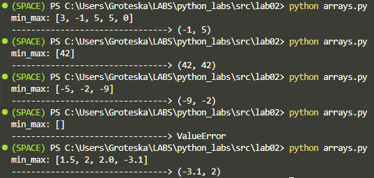

## Лабораторная работа номер 2
### Задание 1 (arrays)
#### Пункт A
```Python
from typing import Union
import json

def min_max(input_data: list[int|float]) -> list[int|float]:
    if input_data==[]:
        return "ValueError"
    else:
        return min(input_data),max(input_data)

print(min_max(json.loads(input("min_max: "))))
# print(min_max([int(float(x)) if float(x)%1==0  else float(x) for x in input().split()]))
```


#### Пункт B
```Python
from typing import Union
import json

def unique_sorted(nums: list[float | int]) -> list[float | int]:
    return sorted(set(nums))

print(unique_sorted(json.loads(input("nique_sorted: "))))
# print(unique_sorted([int(float(x)) if float(x)%1==0  else float(x) for x in input().split()]))
```

#### Пункт C
```Python
from typing import Union
import json
import ast

def flatten(mat: list[list | tuple]) -> list:
    answ=[]
    for i in mat:
        for j in i:
            if str(j) in "0123456789":
                answ.append(j)
            else:
                return "TypeError"    
    return answ

print(flatten(ast.literal_eval(input("flatten: "))))
```

### arrays.py
```Python
from typing import Union
import json
import ast

def min_max(input_data: list[int|float]) -> list[int|float]:
    #print(input_data)
    if input_data==[]:
        return "ValueError"
    #if all([str(x) in "0123456789" for x in IN_string.split()]):
    #    for x in IN_string.split():
    #        if x.find("."):
    #            work_mas.append(float(x))
    #        else:
    #            work_mas.append(int(x))
    else:
        return min(input_data),max(input_data)

def unique_sorted(nums: list[float | int]) -> list[float | int]:
    return sorted(set(nums))

def flatten(mat: list[list | tuple]) -> list:
    answ=[]
    for i in mat:
        for j in i:
            if str(j) in "0123456789":
                answ.append(j)
            else:
                return "TypeError"    
    return answ

print("-------------------------------->",min_max(json.loads(input("min_max: "))))
# print(min_max([int(float(x)) if float(x)%1==0  else float(x) for x in input().split()]))

print("-------------------------------->",unique_sorted(json.loads(input("nique_sorted: "))))
# print(unique_sorted([int(float(x)) if float(x)%1==0  else float(x) for x in input().split()]))

print("-------------------------------->",flatten(ast.literal_eval(input("flatten: "))))
```


## Лабораторная работа номер 1
### Задание 1
```python
name=input("Имя: ")
age=int(input("Возрвст: "))
print(f'Привет, {name}!. Через год тебе будет {age+1}.')
```

### Задание 2
```Python
a=float(input("a: ").replace(",","."))
b=float(input("b: ").replace(",","."))
print(f"sum={round(a+b,2)}; avg={round((a+b)/2,2)}")
```

### Задание 3
```Python
price=float(input('цена: '))
dis=float(input('скидка: '))
vat=float(input('НДС:'))
print(f'База после скидки: {round(price*(1-dis/100),2)}руб.')
print(f'НДС: {round((price*(1-dis/100))*(vat/100),2)}руб.')
print(f'Итог к оплате: {round((price*(1-dis/100))*(vat/100)+price*(1-dis/100),2)}руб.')
```

## Задание 4
```Python
mi=int(input("минуты: "))
print(f'{mi//60}:{mi%60}')
```

## Задание 5
```Python
name,fam,otch=map(str,input("ФИО: ").split())
print(f"ФИО: {name[0].upper()+fam[0].upper()+otch[0].upper()}.")
print(f'Длина (символов): {len(name)+len(fam)+len(otch)+2}')
```

## Задание 6
```Python
n=int(input())
och=[]
zoch=[]
for i in range(n):
    name,fam,age,form=map(str,input().split())
    inf=name+" "+fam+" "+age
    if form=="True":
        och.append(inf)
    else:
        zoch.append(inf)
print(len(och),len(zoch))
```

## Задание 7
```Python
crashSTR=input("string: ")
answer=""
A=0
B=0
x=0
for i in range(0,len(crashSTR)):
    if crashSTR[i].isupper():
        answer+=crashSTR[i]
        A=int(i)
        for I in range(len(crashSTR[A]),len(crashSTR)):
            if crashSTR[I] in "0123456789":
                B=int(I)+1
                break
        while A+x<len(crashSTR):
            x+=(B-A)
            if A+x<len(crashSTR):
                answer+=crashSTR[A+x]
if answer[-1]!=".":
    answer+=crashSTR[-1]
print(answer)
```

